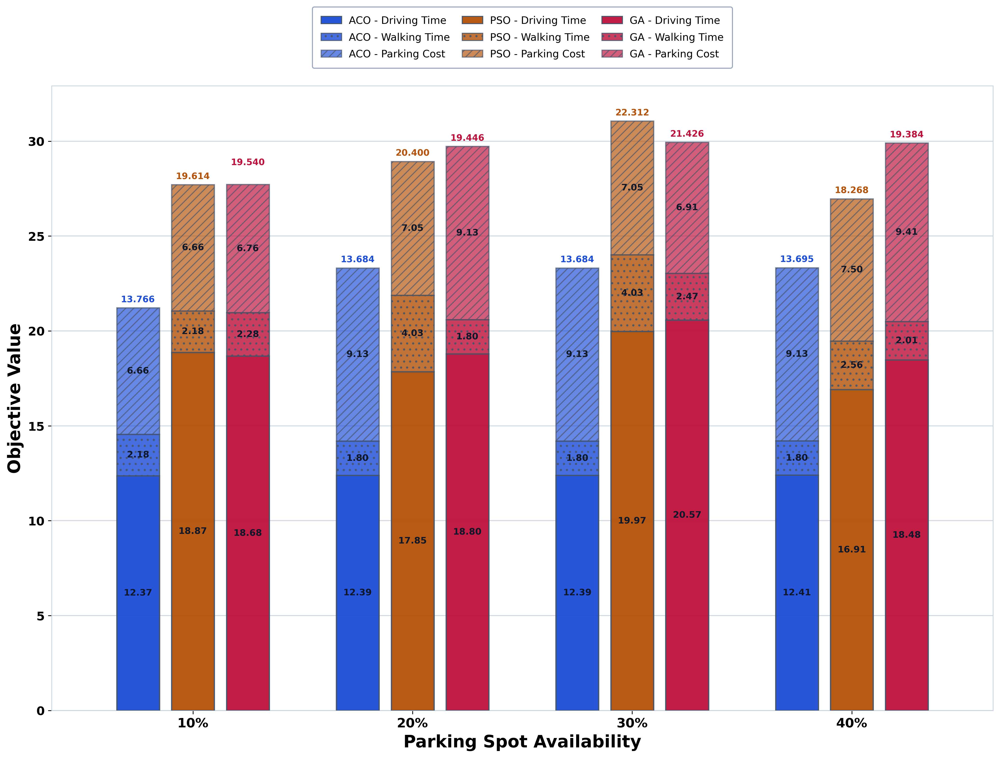

# Dynamic Parking Optimisation

> A decision-support system that recommends feasible parking locations by balancing travel time, walking distance, parking cost, and traffic conditions.

This project is the final implementation of a thesis on dynamic parking recommendation. It models parking as a constrained network-optimisation problem, evaluates multiple solution strategies, and preserves the datasets, experiment outputs, and figures required to inspect the results.



## Why this project matters

Urban parking is rarely a "nearest available space" problem. A useful recommendation must account for the time spent driving, the distance walked after parking, the price paid, the available parking supply, and traffic conditions. This repository implements and evaluates that trade-off across baseline parking-lot and parking-spot-level scenarios.

## Engineering highlights

- **Multi-objective optimisation:** combines travel time and parking cost into a configurable objective function.
- **Algorithm comparison:** evaluates Ant Colony Optimisation (ACO), Particle Swarm Optimisation (PSO), and Genetic Algorithms (GA), alongside baseline optimisation and heuristic approaches where applicable.
- **Network simulation:** includes SUMO workflows for traffic-aware experiments.
- **Parking-spot extension:** moves from selecting a parking lot to selecting a feasible individual parking spot, including internal driving and walking time.
- **Reproducible analysis:** preserves experiment datasets, CSV outputs, validation reports, and graph-generation scripts.

## Optimisation objective

The baseline model minimises a weighted combination of external driving/walking time and parking cost:

`Z = alpha * (external_drive_min + external_walk_min) + (1 - alpha) * parking_cost`

The parking-spot extension additionally includes internal movement within the selected lot:

`Z = alpha * (external_drive_min + internal_drive_min + internal_walk_min + external_walk_min) + (1 - alpha) * parking_cost`

`alpha` controls the trade-off between journey time and parking cost.

## Repository guide

| Location | Purpose |
| --- | --- |
| `parking-lot-recommendation-baseline/` | Baseline parking-lot optimisation, algorithms, datasets, and result pipelines. |
| `parking-lot-recommendation-extension/` | Parking-spot-level extension with ACO, PSO, GA, SUMO, and validation workflows. |
| `FINAL_GRAPHS/` | Final figures and source CSVs for baseline and extension experiments. |
| `verification_reports/` | Numerical checks for generated graphs and results. |
| `final_cases/` | Experiment scenarios used to evaluate recommendations. |

## Quick start

Python 3.10 or later is recommended.

```bash
git clone https://github.com/pullisanisatvika/Parking-optimisation.git
cd Parking-optimisation

python3 -m venv .venv
source .venv/bin/activate
pip install -r parking-lot-recommendation-extension/requirements.txt
```

Regenerate the finalised parking-spot-level result summary from the existing logs:

```bash
python3 parking-lot-recommendation-extension/run_phase3_spot_pipeline.py --mode finalize-only
```

Run the full parking-spot experiment pipeline:

```bash
python3 parking-lot-recommendation-extension/run_phase3_spot_pipeline.py --mode run
```

The full run processes experiment cases and can take substantially longer than the finalisation command.

## Outputs

The primary result tables are:

- `parking-lot-recommendation-baseline/RESULTS/master_results_all_methods_for_graphs.csv`
- `parking-lot-recommendation-extension/RESULTS/COMBINED_ALL_METHODS/results_all_methods_spot_level.csv`

The final graphs in `FINAL_GRAPHS/` show how objective components change with parking supply, budget, traffic level, network size, walking-distance limits, edge density, and parking cost.

## Technology

Python, SUMO, ACO, PSO, Genetic Algorithms, network optimisation, data analysis, and Matplotlib.

## Author

Pullisani Satvika
